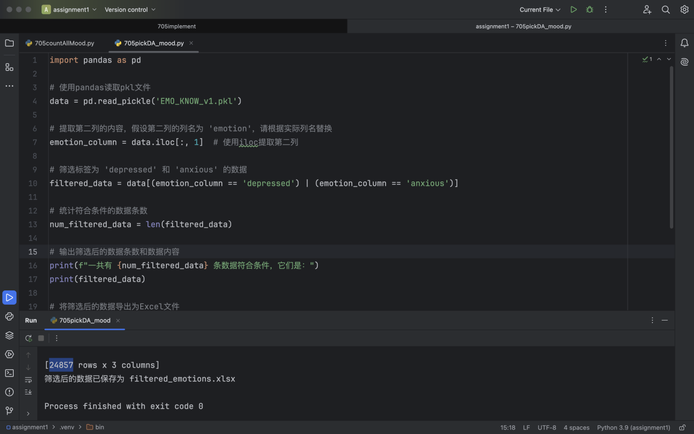

### Data Cleaning Process

In this project, we utilized the **EPITOME framework** to enhance the empathetic responses of a chatbot to tweets expressing negative emotions. To ensure that the model could effectively address these negative emotions, we used the **emo-know dataset** for training.

The **emo-know dataset** contains over 20,000 tweets, and each entry consists of three components:
1. Tweet content
2. Emotion label
3. The cause of the emotion

Since the focus of our experiment is on handling tweets with negative emotions, we performed data cleaning to isolate the relevant tweets before training the model.

#### Data Cleaning Steps:
1. **Emotion Label Statistics**:  
   First, the project team developed the `705countAllMood.py` script to analyze and count the emotion labels present in the emo-know dataset. The analysis revealed **48 distinct emotion labels** in the dataset.

2. **Filtering Negative Emotion Data**:  
   Based on the project requirements, we selected two emotion labels related to negative emotions: `depressed` and `anxious`. Using the `705pickDA_mood.py` script, we extracted all the tweets tagged with these two labels. In total, we gathered **24,875 tweets** labeled with either `depressed` or `anxious`.

3. **Sampling for the Experiment**:  
   To conduct the experiment, we randomly selected **50 tweets labeled as `depressed`** and **50 tweets labeled as `anxious`** from the filtered data for model training and testing.